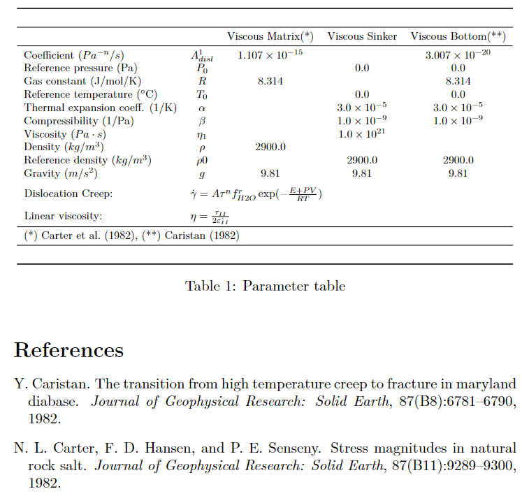

# Tables

There are two different formats of output tables that can be produced:
- LaTeX (always comes with "References.bib" for citations)
- Markdown
# Producing output table

`ParameterTable()` is used to produce an output table of all the material parameters in your phase(s) in LaTeX or Markdown format.
All you need is a dimensional `phase` as defined in section 2. Material Parameters in the README.md of GeoParams. This `phase` should be given to `ParameterTable` as first argument.
There are optional argumemnts which can be given in `ParameterTable`. Those are `format`, `filename` and `rdigits`. The `format` keyword determines whether your table should be in `LaTeX` or `Markdown` format (should be given as string). `filename` determines the name of the file but can also be used to save the file in a different directory other than the GeoParams package directory (should be given as string, note: no file endings needed since they will be determined by the `format` keyword!). `rdigits` gives the numbers of decimals to which all parameter values wil be rounded (should be given as integer).

Example 1:
```julia
julia> MatParam = SetMaterialParams(Name="Viscous Matrix", Phase=1,
                                     Density   = ConstantDensity(),
                                     CreepLaws = LinearViscous(η=1e23Pa*s))

julia> ParameterTable(MatParam, format="tex", filename="ParameterTable", rdigits=4)
```


Example 2:
```julia
julia> ParameterTable(MatParam, format="md", filename="ParameterTable", rdigits=4)
```


```@docs
GeoParams.ParameterTable
GeoParams.Phase2Dict
GeoParams.Phase2DictMd
GeoParams.Dict2LatexTable
GeoParams.Dict2MarkdownTable
GeoParams.detachFloatfromExponent
```
